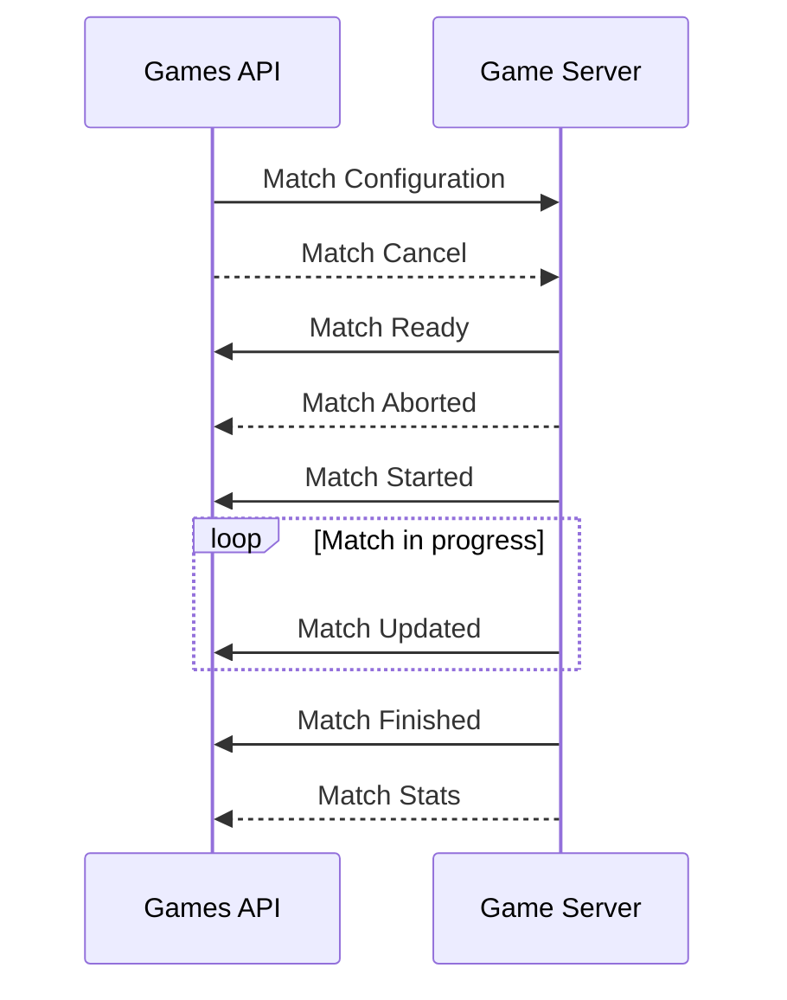

# Jokenpo

This project is a simple game of rock, paper and scissors.

The main objective of this project is to practice integrating an external game
with a tournament system.

Inspiration comes from [Faceit Match Lifecycle](https://developers.faceit.com/start/games/best-practices) and
previous experience working at [GamersClub](https://gamersclub.gg).

From Faceit documentation:

